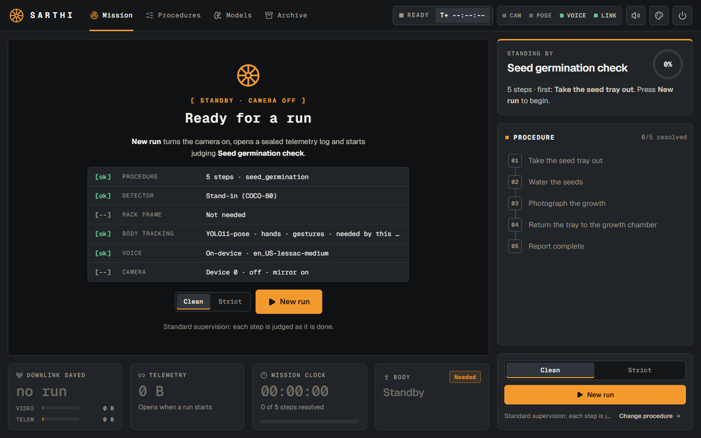
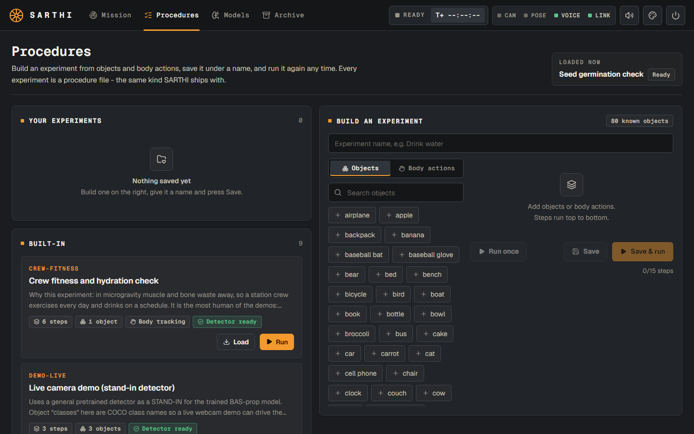
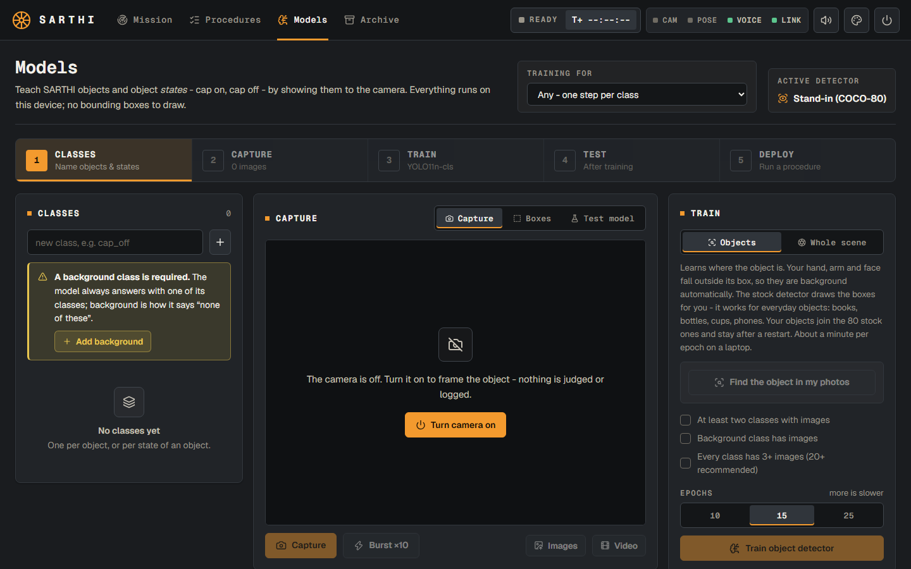
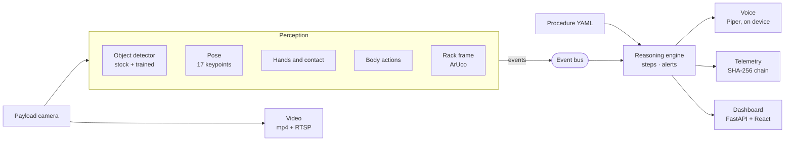

<div align="center">


# SARTHI

### The on-board assistant that watches a space experiment, guides every step and catches mistakes. Fully offline.

**Smart India Hackathon 2026** · Problem Statement **SIH26174** · ISRO / Department of Space · **Team Hashira**


[Overview](#overview) · [Features](#features) · [Quick start](#quick-start) · [Guide](#guide) · [Tech stack](#tech-stack) · [Architecture](#architecture) · [Docs](#documentation)

<br />



</div>

---

## Overview

On the **Bharatiya Antariksh Station (BAS)** and on lunar missions, the ground cannot watch every
experiment live: communication is delayed and bandwidth is scarce. A missed step, a wrong sample
container or a skipped log entry can cost the science.

**SARTHI** is an AI human activity recognition system that runs **on board**. A fixed payload
camera watches the crew member; SARTHI knows the experiment's steps, recognises the objects and
what the person is doing with them, **speaks the next step**, raises a **voice alert** the moment
something goes wrong, and writes a **timestamped, tamper-evident log** that is sent to the ground
instead of raw video.

> *Sarthi* means charioteer: the one who guides. The name also reads as **S**atellite **A**ssistant
> for **R**esearch, **T**actical **H**olistic & **I**nterface.

### What the problem statement asks, and where SARTHI answers it

| SIH26174 asks for | SARTHI |
|---|---|
| Continuously process local video to track the experiment | Live pipeline: camera, object detection, pose, hand contact and gestures, every frame |
| Suggest the next step, at the start and after each step | Spoken prompt from an on-device voice, plus the step on screen |
| Voice alert when a step is skipped or out of sequence | Skip and out-of-sequence alerts, plus **wrong object** and **wrong hand** |
| A timestamped, structured, lightweight text log | Per-run JSONL chained with SHA-256: a few kilobytes, verifiable byte by byte |
| Stream video to an IP and store it locally | Local mp4 recording on by default, RTSP stream with `--rtsp` |
| A GUI to monitor all of it | React console: Mission, Procedures, Models, Archive |
| Dataset generation and a trained model, offline | On-device training from your own photos or video, plus a dataset pipeline |
| Optional: no fixed up or down in orbit | Body actions measured in the body's own frame; rack-relative positions from ArUco markers |

---

## Features

| | |
|---|---|
| **Human activity recognition** | 13 body actions read from the skeleton: 9 postures and 4 movements (wave, lift, lower, clap). One-hand actions can require the **left or right** hand. |
| **Hand and object interaction** | Knows which hand touches which object, and what is done with it: **show, hold, pour, move**, or put it back in its place. |
| **Objects** | 80 everyday objects out of the box, several at once. Teach it your own objects or object states (cap on, cap off) from photos or a short video, no box drawing. A solid-coloured block, like a blue cube, is found by its colour with no training at all. |
| **Orientation-agnostic** | Every posture is measured against the body's own axis, so a crew member upside down raises a hand exactly as one standing does. |
| **Step-by-step supervision** | Steps are judged in order with confidence thresholds; the system says *cannot verify* rather than guess. |
| **Spoken alerts** | Wrong object, wrong hand, skipped step, out of sequence, no progress, cannot verify. |
| **Experiments are files** | Every experiment is a YAML procedure. Build one in the no-code builder, save it by name, run it again any time. |
| **Tamper-evident record** | Hash-chained telemetry; the Archive re-verifies it and names the exact record if a byte changed. |
| **Offline and edge-ready** | No cloud, no telemetry upload, no CDN. A test guards it. Runs on a laptop CPU; export path to a Jetson. |

<table>
  <tr>
    <td width="50%"></td>
    <td width="50%"></td>
  </tr>
  <tr>
    <td align="center"><b>Procedures</b>: build, save and run experiments</td>
    <td align="center"><b>Models</b>: teach new objects on the device</td>
  </tr>
</table>

---

## Quick start

**You need:** Python **3.11**, Node.js **20.19+** and a webcam.

**1. Install.** With [uv](https://docs.astral.sh/uv/) (recommended):

```bash
uv sync --all-extras --group dev
```

or with pip, inside a Python 3.11 virtual environment:

```bash
pip install -r requirements.txt
```

[`requirements.txt`](requirements.txt) pins the exact versions the test suite passes with and
installs SARTHI itself.

**2. Build the dashboard** (once):

```bash
cd ui && npm install && npm run build
```

**3. Add the voice** (once, about 60 MB, optional but it is how alerts are meant to be heard):

```bash
uv run python -m piper.download_voices en_US-lessac-medium --data-dir models/voices
```

**4. Run:**

```bash
uv run python scripts/web_demo.py
```

Open **http://localhost:8000**. The detector and pose weights download by themselves on the first
run; after that nothing touches the network.

<details>
<summary><b>Launcher options</b></summary>

| Flag | Effect |
|---|---|
| `--procedure seed_germination` | load a different experiment at start |
| `--autostart` | start a run at launch instead of waiting for **New run** |
| `--world` | YOLO-World open-vocabulary detection (any object you can name) |
| `--no-mirror` | show the camera's true view (mirrored selfie view is the default) |
| `--no-body` | start with body tracking off, to save CPU |
| `--no-trained` | start with the 80 stock objects only |
| `--no-record` | do not record video locally |
| `--rtsp rtsp://IP:8554/live` | also stream the video to an RTSP server |
| `--camera 1` · `--port 8000` · `--host 0.0.0.0` | pick the camera, port, network interface |

</details>

---

## Guide

### Run an experiment

1. **Procedures** tab → *Built-in* → pick an experiment → **Load**.
2. **Mission** tab → choose **Clean** (a step done early counts, and the one you skipped is alerted) or **Strict** (a step done early is held out of sequence) → **New run**.
3. Follow the voice. An alert covers the top of the video until you press **Acknowledge** (or `Esc`).
4. At the end a debrief shows every step with its timing; **End run** releases the camera.
5. **Archive** tab → the run → its steps, alerts, video and **Verify chain**.

### Build your own

1. **Procedures** → *Build an experiment* → give it a name.
2. Add steps from **Objects** (80 stock, plus yours listed first) or **Body actions**.
3. For each step choose what is done with the object (**Show, Hold, Pour, Move**) and **which hand**
   (Either, Left, Right). Leave the wording empty to use the default shown in grey.
4. **Save** puts it under *Your experiments*, kept across restarts. **Save & run** starts it now.

### Teach it a new object

1. **Models** → type the object's name → **+**. Keep the **background** class.
2. Capture **40 to 60 photos** per object or state, in the room you will run in: different
   angles, distances, both hands. Give **background 60 to 80**: the empty table, empty hands,
   your face, and every *other* prop on its own. A 15 to 20 second video also works.
3. **Train → Objects** → **Find the object in my photos** → check the boxes → **Train object
   detector** (about 15 minutes on a laptop).
4. **Test model** live → **Deploy**. Your object joins the 80 stock ones and stays after a restart.

### Built-in experiments

| Experiment | What it shows | Training |
|---|---|---|
| **Seed germination check** | ISRO's Axiom-4 sprouting experiment: tray out, water, photograph, return to the growth chamber | none |
| **Crew fitness and hydration check** | Left and right hand steps, a wave, lifting the bottle while holding it; the wrong-hand alert | none |
| **Potable water sampling** | Two objects in one step; the wrong-object alert | none |
| **Drink water** | Pick up, open, drink, close, put back. A body-only version and a trained cap-state version | optional |
| **Blue cube from A to B** | Pick the cube up from position A with the right hand, place it on B. Found by colour | none |
| **Nested sample retrieval (PROC-A)** | The problem statement's own example on a marked payload rack | props + model |

The **[experiment catalogue (PDF)](docs/experiments/SARTHI-Experiment-Catalogue.pdf)** describes
21 experiments, 14 for a space station and 7 on Earth, each with its props, every step, what
SARTHI checks and the exact builder settings.

### Body actions

| One hand (left or right) | Both hands or whole body | Movements |
|---|---|---|
| Raise a hand · Hand to face · Hand on head · Reach out | Both hands up · Hands together · Arms crossed · Arms out · Hands on hips | Wave · Lift · Lower · Clap |

Hold each action for about a second and keep both elbows in view. Holds are timed in seconds, not
frames, so a slower laptop does not make you hold longer. Movements are read from frame to frame,
so on a laptop make them slow and wide.

### Alerts

| Alert | When | Mode |
|---|---|---|
| **Skipped** | The next step is done before this one | Clean |
| **Out of sequence** | The next step is done before this one; it waits for this one | Strict |
| **Wrong object** | You pick up what a step further ahead needs | always |
| **Wrong hand** | The other hand does a left or right step | always |
| **No progress** | A step is left undone for its time limit | always |
| **Cannot verify** | The evidence is too weak to trust | always |

---

## Tech stack

| Layer | Technology |
|---|---|
| **Language and runtime** | Python 3.11 · [uv](https://docs.astral.sh/uv/) |
| **Object detection** | Ultralytics **YOLO11n** (COCO-80) · on-device fine-tuning for your own objects |
| **Human pose and activity** | **YOLO11n-pose** (17 keypoints) · body-frame gesture reader · hand-object contact inference |
| **Rack localisation** | OpenCV **ArUco** markers and homography to rack millimetres |
| **Reasoning** | Pydantic procedure schema · pure predicate functions · step state machine with calibrated abstention |
| **Server** | **FastAPI** · Uvicorn · WebSocket live state · MJPEG video |
| **Storage and integrity** | SQLite with migrations · JSONL telemetry chained with **SHA-256** |
| **Voice** | **Piper** text to speech, on device, pre-rendered prompts |
| **Video** | OpenCV mp4 recording · FFmpeg RTSP publishing |
| **Dashboard** | **React 19** · TypeScript · Vite · Lucide icons · Geist font bundled |
| **Quality** | pytest (482 tests, golden replay corpus) · ruff · import-linter · oxlint · GitHub Actions |

---

## Architecture



**The event bus is the seam.** Perception publishes what it sees and knows nothing about
experiments; the engine judges steps and knows nothing about cameras or models. An
import-linter contract enforces the split, which is why the whole reasoning layer is tested
without a camera, and why a recorded run can be replayed if a camera fails in front of a jury.

**Experiments are configuration, never code.** A new experiment is a new YAML file; the engine
does not change.

<details>
<summary><b>How a step is judged</b></summary>

1. Every frame, perception emits detections, hand contacts, pose and body actions.
2. Each step lists **predicates**: `detect`, `contact` (optionally with a hand), `gesture`,
   `tilted` (pouring), `moved`, `dwell` (in a region), `near`, `count`, `absent`.
3. A predicate must hold for a moment (timed in seconds, not frames), so a flicker is not a step.
4. The engine completes a step above a confidence threshold, and below another it says
   **cannot verify** instead of guessing.
5. Only the current step and the next one are judged, so resting state, like a bottle already
   standing in its place, never completes a later step by accident. Nor does evidence left over
   from the step before: two hands meeting to open a cap do not also close it.

</details>

---

## Project structure

```
Clippy/
├── src/orbital_har/
│   ├── core/           event types and the event bus
│   ├── perception/     camera, detector, pose, hands, gestures, rack frame, pipeline
│   ├── reasoning/      procedure schema, predicates, observation window, engine
│   ├── runtime/        live session, telemetry chain, store, voice, video, training, experiments
│   ├── server/         FastAPI app: REST, WebSocket, video stream
│   └── datagen/        dataset, labelling, training, evaluation and export pipeline
├── ui/                 React dashboard (Mission, Procedures, Models, Archive)
├── procedures/         built-in experiments as YAML
├── migrations/         numbered SQL migrations
├── tests/              unit tests and the golden replay corpus
├── docs/               requirements, design, experiment catalogue, screenshots
├── scripts/            launchers
└── requirements.txt    pinned install for pip
```

The Python package is still named `orbital_har`, the project's earlier working title. The product
is **SARTHI**.

---

## Testing and quality

```bash
uv run pytest                  # 482 tests, including the golden replay corpus
uv run ruff check .            # lint
uv run lint-imports            # perception and reasoning never import each other
uv run orbital-har demo proc_a_skip_s4    # replay a recorded run with a skipped step
```

The **golden replay corpus** holds recorded event streams with the verdicts the engine must
reach: clean runs, skips, out-of-order steps, occlusion, inversion and stalls. It runs with no
camera and no model.

<details>
<summary><b>Training the payload-prop detector</b></summary>

The dataset pipeline for the problem statement's sample experiment is built; it needs footage of
the props. See the [dataset guide](docs/07-DATASET-GUIDE.md).

```bash
uv run orbital-har dataset init  --root datasets/bas
uv run orbital-har dataset label --root datasets/bas
uv run orbital-har dataset split --root datasets/bas
uv run orbital-har dataset stats --root datasets/bas
uv run orbital-har train  --data datasets/bas/data.yaml
uv run orbital-har eval   --weights runs/bas/weights/best.pt --save
uv run orbital-har export runs/bas/weights/best.pt --format onnx
```

Classes come from the procedure YAML, never hardcoded, and training augments rotation to ±180°
because there is no floor in orbit.

</details>

---

## Documentation

| Document | What is in it |
|---|---|
| [Experiment catalogue (PDF)](docs/experiments/SARTHI-Experiment-Catalogue.pdf) | 21 experiments, capabilities, how to run, build and train |
| [Product requirements](docs/01-PRD.md) | Requirement IDs, acceptance criteria, scope |
| [Technical requirements](docs/02-TRD.md) | Stack, module contracts, event schema, predicates, budgets |
| [Application flow](docs/03-APP-FLOW.md) | Runtime behaviour, every scenario, the API |
| [UI and UX brief](docs/04-UIUX-BRIEF.md) | Screens, components, design tokens |
| [Backend schema](docs/05-BACKEND-SCHEMA.md) | SQLite tables, JSONL formats, the hash chain |
| [Implementation plan](docs/06-IMPLEMENTATION-PLAN.md) | Phases, ownership, descope ladder |
| [Dataset guide](docs/07-DATASET-GUIDE.md) | Props, shot list, labelling, training |
| [Problem statement](docs/SIH26174-problem-statement.md) | The official SIH26174 brief |

---

## Status

**Working today:** live supervision on a webcam, 13 body actions with left and right hands,
wrong-object and wrong-hand alerts, the no-code builder with saved experiments, on-device
training, the tamper-evident record, local video and RTSP, and the full dashboard.

**Next:** a model trained on the physical props of the problem statement's sample experiment,
export to a Jetson edge device, and full 3D body-mesh recovery (optional in the brief).

<div align="center">
<br />

Built by **Team Hashira** for **Smart India Hackathon 2026** · Problem Statement SIH26174 · ISRO

</div>
