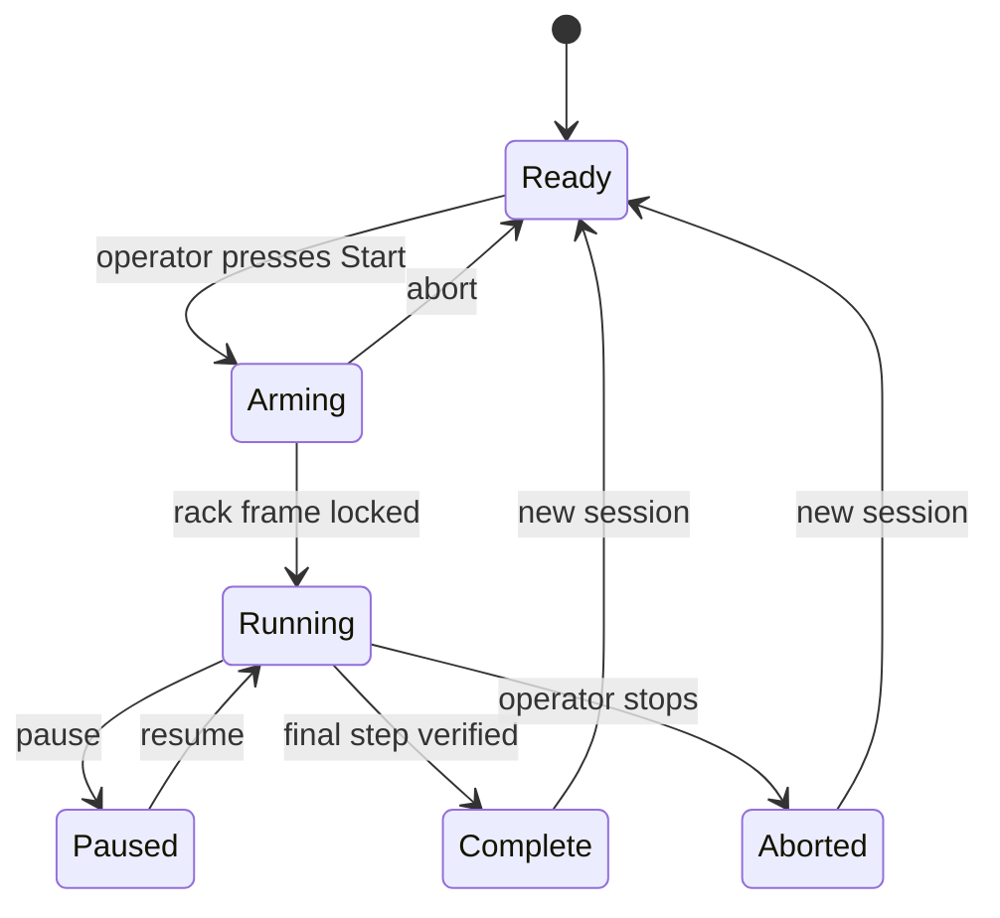
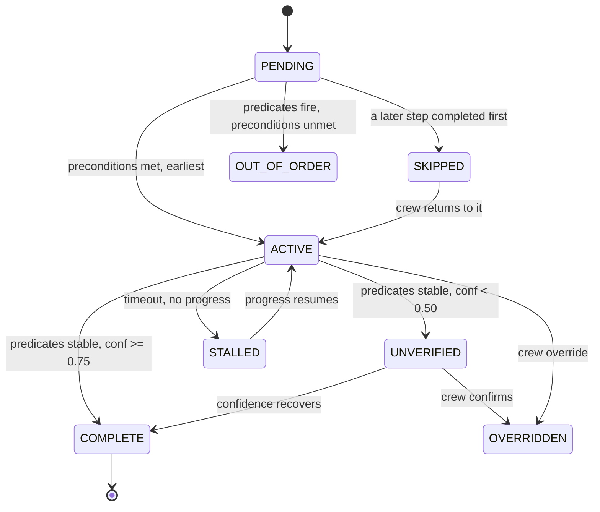

# App Flow - Application Flow

**Project:** ORBITAL-HAR · SIH26174 · Team Hashira
**Version:** 1.0 · 2026-09-20

Defines runtime behaviour: process topology, lifecycles, and every scenario the system must
handle. Data contracts live in the [TRD](02-TRD.md); screen design lives in the
[UI/UX brief](04-UIUX-BRIEF.md).

---

## 1. Process topology

Three OS processes, so a crash in one does not take down the others.

| Process | Contains | Restart policy |
|---|---|---|
| **P-CORE** | Capture, perception, bus, engine, telemetry, store | Manual; crash ends the session cleanly |
| **P-MEDIA** | FFmpeg recorder + RTSP publisher (MediaMTX) | Auto-restart, max 3 attempts |
| **P-SERVE** | FastAPI, WebSocket fan-out, static UI | Auto-restart |

P-CORE is the source of truth. P-SERVE is a read-model with a control channel; it never
computes verdicts. P-MEDIA is fire-and-forget - **if it dies, supervision continues**.
Losing the video recorder must never stop the procedure supervisor.

---

## 2. Startup sequence

```
1  Load config/runtime.yaml, apply env overrides
2  Open SQLite, run migrations
3  Load + validate procedure YAML          ── fail → exit 2, print field path
4  Compile predicates into evaluable form  ── fail → exit 2
5  Load detector, hands, pose models       ── fail → exit 3
6  Pre-synthesize fixed voice prompts      ── fail → warn, fall back to runtime TTS
7  Open camera, confirm frames             ── fail → enter REPLAY-ONLY mode
8  Start P-MEDIA                           ── fail → warn, continue without video out
9  Start P-SERVE, bind loopback
10 Publish system.ready, UI turns ready
```

**Startup rules.** Steps 3-5 are fatal: never run on an invalid procedure or missing model.
Steps 6-8 are degradable: warn, log, continue. The UI shows which subsystems came up
degraded - the operator must never discover a dead subsystem by its silence.

Budget: ≤30 s cold (NFR-08).

---

## 3. Session lifecycle



**Arming** exists to guarantee a rack lock before the first step is judged. It waits up to
10 s for ≥2 ArUco markers. On timeout it offers "continue without rack lock", which
disables orientation invariance and is recorded in the session row. The system states this
consequence plainly rather than degrading silently.

On entering **Running**: create the session row, open the telemetry file with a genesis
hash, start recording and streaming, announce step 1, mark step 1 `ACTIVE`.

On **Complete** or **Aborted**: flush telemetry, write the closing record, finalise video
segments, compute session summary, persist, emit `system.session_end`.

**As built (2026-09-26).** The camera belongs to a run. The console starts in **Ready**
with the camera *off*; **New run** (`POST /api/session/start`) powers it and begins
judging; **End run** (`POST /api/session/stop`) seals the chain and releases the device,
returning to Ready. **Complete** seals the run but keeps the camera on for the debrief.
Starting while a run is live is a restart: the old run is sealed first, judged by its own
engine, before the new one begins. Between runs the camera can be powered alone as a
*preview* (`POST /api/camera`) for training capture - it perceives but judges and logs
nothing. The UI shows **Arming** from Start until the first frame arrives; no run is
logged without frames. The rack-lock wait described above is **not yet implemented**.
`--autostart` restores the old start-on-launch behaviour.

---

## 4. Main loop

Per frame, P-CORE:

```
1  Capture frame, stamp capture time, assign seq
2  Detect ArUco → rack pose → rotation θ
3  Rotate frame by −θ                      (canonicalization)
4  Run detector / hands / pose concurrently on the canonical frame
5  Publish rack, detection, hand, contact, pose events
6  Engine consumes the window, evaluates predicates for ACTIVE and PENDING steps
7  Apply hysteresis; emit step_state / alert only on change
8  On transition → telemetry record, SQLite write, voice queue, WebSocket push
9  Push preview frame with overlays to the dashboard
```

**Back-pressure.** If consumers fall behind, drop the *newest* preview frames first, then
apply the §11 degradation ladder from the TRD. Never drop bus events: they are the record.
Never block capture on a slow consumer.

---

## 5. Step state machine



Order-independent group members (`group: g1`) all become `ACTIVE` together, and none of
them can trigger a skip verdict against another.

---

## 6. Scenario flows

### 6.1 Happy path

```
Operator completes step N
  → predicates true for hold_frames
  → confidence >= 0.75
  → step N COMPLETE
  → telemetry step_complete { dur_s, conf, evidence[] }
  → step N+1 ACTIVE
  → voice "next: <prompt>"
  → crew HUD advances, ground timeline appends
```
Budget: ≤1.5 s from stable evidence (NFR-02).

### 6.2 Skipped step

```
Step 4 PENDING, step 5 predicates reach COMPLETE
  → step 4 SKIPPED
  → alert { kind: skip, severity: high, step_id: s4 }
  → attention tone + urgent voice "step four skipped: open the red box"
  → persistent red banner, both views
  → banner clears only on acknowledge or on step 4 completing
```
Budget: ≤1.0 s (NFR-03).

**Design note.** The system does not roll back or block. It reports and continues - the
crew decides. An advisor that halts the procedure would be worse than no advisor.

### 6.3 Out-of-order

Reserved for genuine sequence inversion: a completing step whose unmet precondition sits
*later* in the procedure. The ordinary "did a later step first" case is a skip (§6.2) and
raises one alert, not two.

```
Step T completes with an unmet precondition of higher ordinal
  → alert names both: observed T, expected the unmet step
  → voice "out of sequence: expected <step>"
  → T is still marked complete: it did happen
```

Under `strict_preconditions: true` the behaviour changes - the step enters `OUT_OF_ORDER`,
is not marked complete, and re-evaluates once its preconditions are met. See TRD §7.6.

**Which mode detects what.** Both modes judge one step ahead (TRD §7.5), so a step done
before its turn is always caught: Clean completes it and raises §6.2's skip alert for the
step passed over, Strict holds it out of sequence. Handling an object that only a step
further ahead uses is §6.3a's wrong-object alert, in both modes.

### 6.3a Wrong object

```
Step 1 "pick up the bottle" ACTIVE; the operator picks up the phone, which only step 3 uses
  → after 6 frames of it in hand (or held up, in a presentation procedure)
  → alert { kind: wrong_object, severity: high, step_id: s3, expected_step_id: s1 }
  → voice "Wrong object: the phone is for step 3. Now: Pick up the bottle"
  → no step changes state; putting the phone down and taking the bottle carries on
```

Quiet for objects an earlier step used, objects the lookahead will judge itself, and
anything already in view when the step began - the resting scene is not an action. At most
one alert per step and object every 10 s. See TRD §7.7.

### 6.3b Wrong hand

```
Step "raise your left hand" ACTIVE; the right hand goes up instead, for 6 frames
  → alert { kind: wrong_hand, severity: medium, step_id: s2 }
  → voice "Wrong hand: use your left hand. Now: Raise your left hand"
  → no step changes state; raising the left hand completes it
```

Quiet when the left hand is up as well, and when the right hand was already up before the
step began. One per step every 10 s. See TRD §7.8.

### 6.4 Low confidence / abstention

```
Predicates true but confidence < 0.50 beyond dwell window
  → step UNVERIFIED
  → alert { kind: unverified, severity: medium }
  → voice "cannot verify step four, please confirm"
  → amber state, Confirm control offered
  → confidence recovers → COMPLETE automatically, alert clears
```
The engine **never** advances on weak evidence. It asks.

### 6.5 Stall

```
timeout_s elapses with no predicate progress
  → step STALLED
  → on_timeout: stall → advisory only; skip → mark skipped; ignore → no action
  → voice advisory once, never repeated
```

### 6.6 Degraded perception

```
Markers lost / occlusion / FPS below floor
  → hold last good rack rotation up to 2 s
  → still lost → alert { kind: degraded }
  → orientation invariance disabled, amber health indicator, reason shown
  → verdicts continue with confidence penalty applied
  → recovery → alert clears, indicator returns to green
```

### 6.7 Crew override

```
Operator activates Override on the current step
  → crew_action { action: override, actor: crew }
  → step OVERRIDDEN, attributed in telemetry
  → procedure advances normally
```
Override is always available and always recorded. Authority stays with the crew.

### 6.8 Free-float advisory (optional, D-07)

```
Object with tether_required: true has no hand contact,
no tether_clip proximity, and non-zero motion for > 1.5 s
  → alert { kind: free_float, severity: low }
  → voice "unsecured object"
  → advisory only, never blocks the procedure
```

---

## 7. Replay mode

```
orbital-har replay --session <id> [--speed 1|4|step]
```

Reads the recorded stream, feeds a fresh engine with no camera and no models, drives
identical UI and voice paths. Telemetry is written to a separate replay file, never
appended to the original.

Replay serves three purposes, in order of importance to the project:
1. **Demo insurance** - camera failure in front of the jury becomes a non-event.
2. **Engine development** - the state machine is built entirely this way before perception
   exists.
3. **Regression testing** - the golden corpus (TRD §12.2) runs through this path.

---

## 8. Voice flow

```
Verdict → voice queue
  ├─ alert   → pre-empt, flush routine queue, attention tone, urgent voice
  └─ routine → append to queue
Queue drains sequentially; never overlap utterances
Muted → skip playback, still log the utterance that would have played
```

Budget: ≤400 ms verdict to audio. Fixed prompts are pre-rendered, so this is a file read,
not a synthesis.

Optional ASR: continuous listening on a fixed grammar. Recognition emits `crew_action`.
Unrecognised speech is silently ignored - never guessed at.

---

## 9. Procedure hot-swap (D-02)

```
1  A live run is sealed first - the new procedure never inherits its steps
2  POST /api/procedure/load { id, start, force }     id = a file stem in procedures/
3  Validate → reject with field path on failure, keep current procedure loaded
4  Check required vocabulary ⊆ loaded detector classes
     mismatch → 409, name the missing classes; force=true is the operator overriding
5  Compile predicates, swap engine config, reset step states
6  start=true begins a run; otherwise the console returns to Ready
7  Push new procedure to UI over WebSocket
```

`GET /api/procedures` lists the library with each file's description (its leading YAML
comment), step count, rack/pose needs and the classes the current detector cannot see,
so the refusal in step 4 is visible before anyone presses Run.

Perception models are **not** reloaded - that is the whole point. Budget ≤10 s (NFR-11).

The vocabulary check in step 4 is what keeps the claim honest: the system refuses a
procedure it genuinely cannot perceive, rather than failing mysteriously at step 3 in front
of the jury.

---

## 10. Shutdown and crash

**Graceful:** stop capture → drain bus → close telemetry with a closing record → finalise
video → close DB → stop child processes.

**Crash:** telemetry and bus files are append-only and fsynced every 2 s, so at most 2 s is
lost. Video loses at most one 60 s segment. On restart, sessions left open are marked
`aborted` with `crash_recovered = true`. No session is ever silently lost.

---

## 11. API surface (P-SERVE)

| Method | Path | Purpose |
|---|---|---|
| GET | `/api/health` | Subsystem status, phase, camera state |
| GET | `/api/procedure` | Current procedure and step states |
| GET | `/api/procedures` | Procedure library, with what each needs (§9) |
| POST | `/api/procedure/load` | Hot-swap (§9) |
| POST | `/api/experiments` | Save a dashboard-built experiment by name (edit with `id`) |
| GET | `/api/experiments/{id}` | A saved experiment as builder steps, to edit it |
| DELETE | `/api/experiments/{id}` | Delete a saved experiment |
| POST | `/api/session/start` | Begin: power the camera, start judging (restart if live) |
| POST | `/api/session/stop` | End: seal the chain, release the camera |
| POST | `/api/camera` | Camera preview without a run (training capture) |
| POST | `/api/camera/mirror` | Mirror the displayed picture (selfie view); perception never flips |
| POST | `/api/body` | Body tracking on/off (pose, hands, contact, gestures); forced on when a step needs it |
| GET | `/api/train/classes` | Training set per class, readiness, data advice |
| POST | `/api/train/prepare` | Create the classes a library procedure needs, plus background |
| POST | `/api/train/start` | Train on-device: `mode=detect` (boxes) or `classify` (whole scene); held-out report |
| POST | `/api/train/boxes/propose` | Stock detector proposes the object's box in every photo; suspect background photos start left out |
| GET | `/api/train/boxes` | Proposed boxes per class, faint (low-confidence) ones, exclusions, suspect background photos |
| GET | `/api/train/boxes/image` | One photo with its proposed box, for the review grid |
| POST | `/api/train/boxes/toggle` | Leave a photo out of training, or bring one back (suspect background included) |
| GET | `/api/train/predict` | Test stage: the model's verdict on the current frame, by the run rule |
| POST | `/api/build` | Run builder steps once without saving; objects the detector cannot see are refused. A step is `{object, gesture, instruction, hand: any\|left\|right, how: show\|hold\|pour\|move}` |
| POST | `/api/train/use` | Deploy the trained model (detector or classifier) and start a run, optionally with a named procedure |
| POST | `/api/skip` | Crew skip of the current step |
| POST | `/api/shutdown` | Seal, release the camera, exit the process |
| POST | `/api/session/override` | Crew override |
| POST | `/api/session/acknowledge` | Clear an alert banner |
| POST | `/api/voice/mute` | Toggle mute |
| GET | `/api/sessions` | History |
| GET | `/api/sessions/{id}/telemetry` | Download log |
| GET | `/api/sessions/{id}/verify` | Run chain verifier |
| GET | `/video` | Preview stream with overlays (MJPEG) |
| WS | `/ws` | Live state, alerts, health |

All bound to loopback by default. RTSP is the only externally-bound port, and only because
the brief requires it.

---

**Related:** [PRD](01-PRD.md) · [TRD](02-TRD.md) · [UI/UX brief](04-UIUX-BRIEF.md) ·
[Backend schema](05-BACKEND-SCHEMA.md) · [Implementation plan](06-IMPLEMENTATION-PLAN.md)
