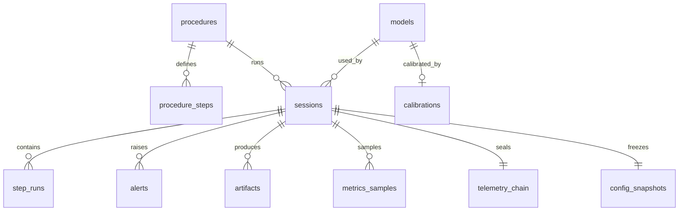

# Backend Schema

**Project:** ORBITAL-HAR · SIH26174 · Team Hashira
**Version:** 1.0 · 2026-09-20

---

## 1. Storage strategy

Three tiers, each chosen for what it is actually good at.

| Tier | Technology | Holds | Why |
|---|---|---|---|
| **Relational** | SQLite (WAL) | Session metadata, step outcomes, alerts, artifacts, model registry, health samples | Queryable, transactional, embedded, zero-ops |
| **Append log** | JSONL | Raw event stream, hash-chained telemetry | Sequential write, crash-tolerant, the deliverable artifact |
| **Blob** | Filesystem | Video segments, model weights, snapshots | Large binaries do not belong in a database |

**Why SQLite and not Postgres.** The system must run standalone with no network and no
service dependencies (FR-60). A server-based database would contradict the core premise of
the product. SQLite in WAL mode handles concurrent readers with a single writer, which is
exactly this workload.

**What deliberately does not go in SQLite.** Per-frame detections, hand landmarks, and pose
keypoints. At 22 FPS these are tens of thousands of rows per minute with no query value.
They live in the JSONL event stream. SQLite stores *outcomes*; JSONL stores *observations*.

### 1.1 Layout on disk

```
data/
├── orbital.db                         SQLite
├── sessions/
│   └── 20260920T132451Z-a3f1/
│       ├── events.jsonl               raw bus stream (replayable)
│       ├── telemetry.jsonl            hash-chained deliverable
│       ├── config.snapshot.yaml       exact config used
│       ├── procedure.snapshot.yaml    exact procedure used
│       └── video/seg_00001.mp4 …
└── models/
    ├── detect/yolo11s-orbital-v3.pt
    └── detect/yolo11s-orbital-v3.engine
```

Session folders are self-contained: a folder plus the database row fully reconstructs a run.

---

## 2. Entity relationships



---

## 3. Schema (DDL)

```sql
PRAGMA journal_mode = WAL;
PRAGMA foreign_keys = ON;

CREATE TABLE schema_version (
    version     INTEGER NOT NULL,
    applied_at  TEXT    NOT NULL
);

-- ---------------------------------------------------------------- procedures

CREATE TABLE procedures (
    id           TEXT PRIMARY KEY,           -- 'nested_box_sample'
    name         TEXT    NOT NULL,
    version      INTEGER NOT NULL,
    vocabulary   TEXT    NOT NULL,           -- required detector vocabulary
    rack_markers TEXT    NOT NULL,
    yaml_sha256  TEXT    NOT NULL,           -- integrity of the source file
    source_path  TEXT    NOT NULL,
    step_count   INTEGER NOT NULL,
    created_at   TEXT    NOT NULL,
    UNIQUE (id, version)
);

CREATE TABLE procedure_steps (
    procedure_id  TEXT    NOT NULL REFERENCES procedures(id) ON DELETE CASCADE,
    step_id       TEXT    NOT NULL,
    ordinal       INTEGER NOT NULL,
    name          TEXT    NOT NULL,
    voice_prompt  TEXT    NOT NULL,
    group_id      TEXT,                      -- order-independent group
    preconditions TEXT    NOT NULL,          -- JSON array of step_id
    requires      TEXT    NOT NULL,          -- JSON array of predicates
    any_of        TEXT,                      -- JSON array or NULL
    timeout_s     INTEGER,
    on_timeout    TEXT CHECK (on_timeout IN ('stall','skip','ignore')),
    PRIMARY KEY (procedure_id, step_id)
);

-- ------------------------------------------------------------------ sessions

CREATE TABLE sessions (
    id               TEXT PRIMARY KEY,       -- '20260920T132451Z-a3f1'
    procedure_id     TEXT NOT NULL REFERENCES procedures(id),
    procedure_version INTEGER NOT NULL,
    detect_model_id  INTEGER REFERENCES models(id),
    mode             TEXT NOT NULL CHECK (mode IN ('live','replay')),
    replay_of        TEXT REFERENCES sessions(id),
    status           TEXT NOT NULL CHECK (status IN
                        ('running','complete','aborted','crashed')),
    started_at       TEXT NOT NULL,
    ended_at         TEXT,
    duration_ms      INTEGER,
    rack_locked      INTEGER NOT NULL DEFAULT 0,   -- 0 = ran without rack lock
    operator_label   TEXT,
    device           TEXT,                          -- 'RTX laptop' | 'Orin Nano'
    crash_recovered  INTEGER NOT NULL DEFAULT 0,
    steps_total      INTEGER,
    steps_complete   INTEGER,
    steps_skipped    INTEGER,
    steps_out_of_order INTEGER,
    steps_unverified INTEGER,
    steps_overridden INTEGER,
    alert_count      INTEGER,
    notes            TEXT,
    session_dir      TEXT NOT NULL
);

CREATE INDEX idx_sessions_started ON sessions(started_at DESC);
CREATE INDEX idx_sessions_status  ON sessions(status);

-- ----------------------------------------------------------------- step runs

CREATE TABLE step_runs (
    id             INTEGER PRIMARY KEY AUTOINCREMENT,
    session_id     TEXT NOT NULL REFERENCES sessions(id) ON DELETE CASCADE,
    step_id        TEXT NOT NULL,
    ordinal        INTEGER NOT NULL,
    state          TEXT NOT NULL CHECK (state IN
                     ('pending','active','complete','skipped',
                      'out_of_order','unverified','overridden','stalled')),
    activated_at   TEXT,
    resolved_at    TEXT,
    duration_ms    INTEGER,
    confidence     REAL,
    evidence       TEXT,        -- JSON: predicate -> {value, conf, satisfied}
    reason         TEXT,        -- human-readable justification
    override_actor TEXT,        -- 'crew' when overridden
    expected_step  TEXT,        -- populated on out_of_order
    UNIQUE (session_id, step_id)
);

CREATE INDEX idx_step_runs_session ON step_runs(session_id, ordinal);
CREATE INDEX idx_step_runs_state   ON step_runs(state);

-- -------------------------------------------------------------------- alerts

CREATE TABLE alerts (
    id              INTEGER PRIMARY KEY AUTOINCREMENT,
    session_id      TEXT NOT NULL REFERENCES sessions(id) ON DELETE CASCADE,
    bus_seq         INTEGER NOT NULL,
    kind            TEXT NOT NULL CHECK (kind IN
                      ('skip','out_of_order','stall','unverified',
                       'free_float','degraded')),
    severity        TEXT NOT NULL CHECK (severity IN ('low','medium','high')),
    step_id         TEXT,
    expected_step_id TEXT,
    message         TEXT NOT NULL,
    raised_at       TEXT NOT NULL,
    acknowledged_at TEXT,
    auto_resolved   INTEGER NOT NULL DEFAULT 0,
    spoken          INTEGER NOT NULL DEFAULT 0
);

CREATE INDEX idx_alerts_session ON alerts(session_id, raised_at);

-- ----------------------------------------------------------------- artifacts

CREATE TABLE artifacts (
    id         INTEGER PRIMARY KEY AUTOINCREMENT,
    session_id TEXT NOT NULL REFERENCES sessions(id) ON DELETE CASCADE,
    kind       TEXT NOT NULL CHECK (kind IN
                 ('telemetry','event_stream','video_segment',
                  'config_snapshot','procedure_snapshot')),
    path       TEXT NOT NULL,
    bytes      INTEGER NOT NULL,
    sha256     TEXT NOT NULL,
    created_at TEXT NOT NULL
);

CREATE INDEX idx_artifacts_session ON artifacts(session_id, kind);

-- ----------------------------------------------------------- telemetry chain

CREATE TABLE telemetry_chain (
    session_id     TEXT PRIMARY KEY REFERENCES sessions(id) ON DELETE CASCADE,
    genesis_hash   TEXT NOT NULL,
    last_seq       INTEGER NOT NULL,
    last_hash      TEXT NOT NULL,
    record_count   INTEGER NOT NULL,
    bytes_written  INTEGER NOT NULL,
    raw_video_equiv_bytes INTEGER,      -- for the downlink ratio claim
    verified_at    TEXT,
    verified_ok    INTEGER,
    first_bad_seq  INTEGER              -- NULL when the chain is intact
);

-- -------------------------------------------------------------------- models

CREATE TABLE models (
    id          INTEGER PRIMARY KEY AUTOINCREMENT,
    name        TEXT NOT NULL,          -- 'yolo11s-orbital'
    task        TEXT NOT NULL CHECK (task IN ('detect','pose','hands')),
    version     TEXT NOT NULL,
    file_path   TEXT NOT NULL,
    file_sha256 TEXT NOT NULL,
    classes     TEXT,                   -- JSON array
    metrics     TEXT,                   -- JSON: mAP50, mAP50-95, per-class
    trained_at  TEXT,
    dataset_tag TEXT,                   -- links a model to its training set
    notes       TEXT,
    UNIQUE (name, version)
);

CREATE TABLE calibrations (
    id           INTEGER PRIMARY KEY AUTOINCREMENT,
    model_id     INTEGER NOT NULL REFERENCES models(id) ON DELETE CASCADE,
    temperature  REAL NOT NULL,
    tau_complete REAL NOT NULL,
    tau_abstain  REAL NOT NULL,
    dataset_hash TEXT NOT NULL,
    ece          REAL,                  -- expected calibration error
    fitted_at    TEXT NOT NULL
);

-- ------------------------------------------------------------ health samples

CREATE TABLE metrics_samples (
    id          INTEGER PRIMARY KEY AUTOINCREMENT,
    session_id  TEXT NOT NULL REFERENCES sessions(id) ON DELETE CASCADE,
    t           TEXT NOT NULL,
    fps         REAL,
    latency_ms  REAL,
    mem_mb      REAL,
    gpu_util    REAL,
    power_w     REAL,                   -- populated on edge hardware
    dropped_frames INTEGER,
    degraded_level INTEGER NOT NULL DEFAULT 0
);

CREATE INDEX idx_metrics_session ON metrics_samples(session_id, t);

-- --------------------------------------------------------- config snapshots

CREATE TABLE config_snapshots (
    session_id  TEXT PRIMARY KEY REFERENCES sessions(id) ON DELETE CASCADE,
    runtime_yaml TEXT NOT NULL,
    procedure_yaml TEXT NOT NULL,
    git_sha     TEXT,
    created_at  TEXT NOT NULL
);
```

---

## 4. JSONL formats

### 4.1 Event stream — `events.jsonl`

Raw bus output, one envelope per line, exactly as specified in [TRD §4](02-TRD.md).
High volume, never loaded wholesale, consumed by streaming. This is the replay source.

### 4.2 Telemetry — `telemetry.jsonl`

The deliverable. One record per **state transition**, never per frame.

```json
{"seq":7,"t":"2026-09-20T13:25:09.113Z","ev":"step_complete","step":"s3","ord":3,
 "conf":0.91,"dur_s":15.7,"ev_src":["detect:yellow_box_open@0.93",
 "near:yellow_box,Y@0.88"],"prev":"7c21…","hash":"e04a…"}
```

| Event | Fields |
|---|---|
| `session_start` | procedure, version, device, model, rack_locked |
| `step_active` | step, ord |
| `step_complete` | step, ord, conf, dur_s, ev_src[] |
| `step_skipped` | step, ord, detected_at |
| `step_out_of_order` | step, expected |
| `step_unverified` | step, conf |
| `step_overridden` | step, actor |
| `alert` | kind, severity, message |
| `anomaly` | kind, detail |
| `degraded` | level, reason |
| `session_end` | status, totals, bytes |

Keys are abbreviated deliberately — the 50 KB/hour budget (FR-43) is a requirement, and
verbose keys are the easiest way to blow it.

### 4.3 Hash chain

```
hash_n = SHA256( prev_hash_n || canonical_json(record_n minus "hash") )
prev_hash_0 = "0" × 64
```

Canonical JSON: sorted keys, no whitespace, UTF-8. On session end, `telemetry_chain` is
updated with the final hash and record count. `GET /api/sessions/{id}/verify` re-walks the
file and writes `verified_ok` plus `first_bad_seq`.

---

## 5. Queries the API depends on

| Endpoint | Query shape |
|---|---|
| Session list | `sessions` ordered by `started_at DESC`, limit/offset |
| Session detail | `sessions` + `step_runs` by ordinal + `alerts` |
| Live procedure state | `step_runs` for the active session (also held in memory) |
| Health graph | `metrics_samples` for a session, downsampled |
| Verify | `telemetry_chain` + file walk |
| Model registry | `models` joined to `calibrations` |
| Downlink ratio | `telemetry_chain.bytes_written` vs `raw_video_equiv_bytes` |

Live UI state is served from memory and pushed over WebSocket. **SQLite is never on the
per-frame path** — it is written on transitions and on a health-sample timer only.

---

## 6. Retention

| Data | Retention |
|---|---|
| Video segments | 14 days unless the session is tagged `keep` |
| Event streams | 30 days; golden-corpus sessions kept forever |
| Telemetry | Never deleted — it is small and it is the deliverable |
| Metrics samples | 30 days |
| Session rows | Never deleted |

`scripts/prune.py` enforces this and is the safeguard against the 150 GB ceiling. Deleting
blobs never deletes the session row: the record outlives the media, which is exactly the
behaviour the mission framing implies.

---

## 7. Migrations

Plain numbered SQL files in `migrations/NNN_description.sql`, applied in order at startup,
tracked in `schema_version`. No ORM-generated migrations — the schema is small enough that
hand-written SQL is clearer and reviewable in a hackathon setting.

Forward-only. Breaking a migration during development is resolved by deleting `orbital.db`
and replaying sessions; session folders are the durable artifact, not the database.

---

**Related:** [PRD](01-PRD.md) · [TRD](02-TRD.md) · [App flow](03-APP-FLOW.md) ·
[UI/UX brief](04-UIUX-BRIEF.md) · [Implementation plan](06-IMPLEMENTATION-PLAN.md)
